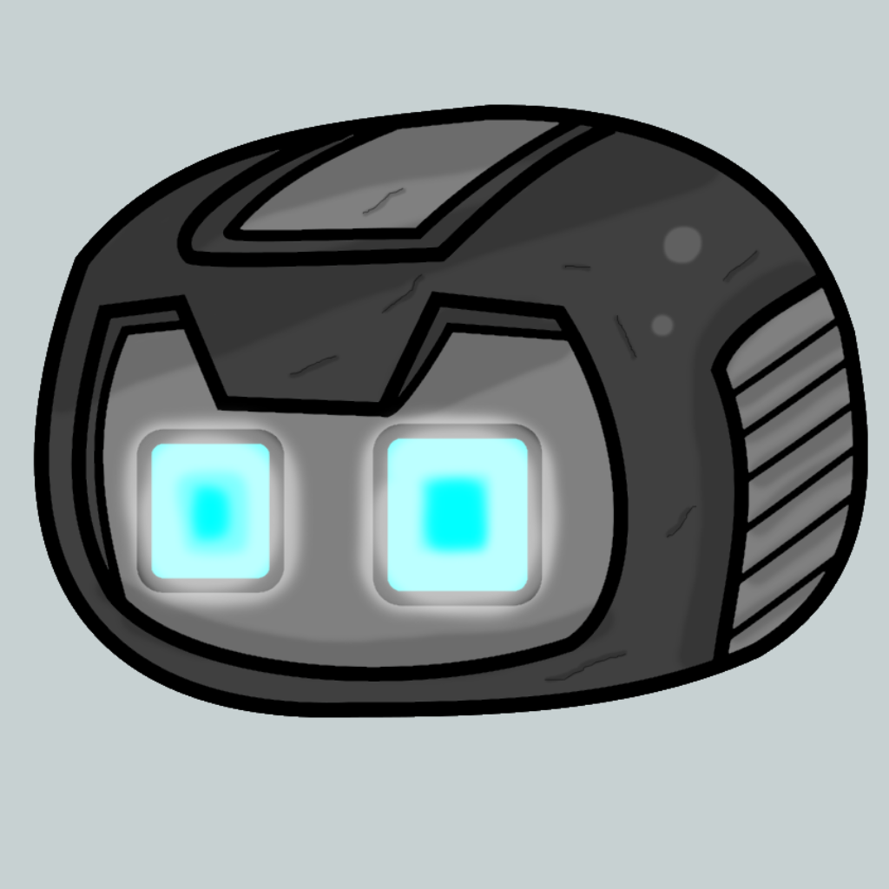
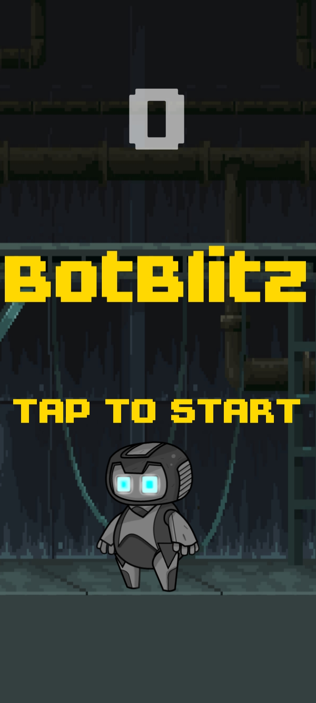
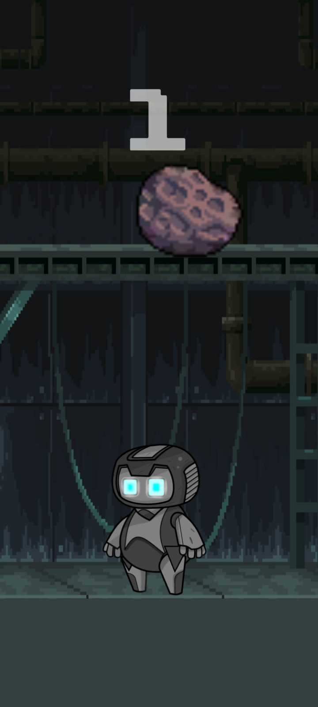
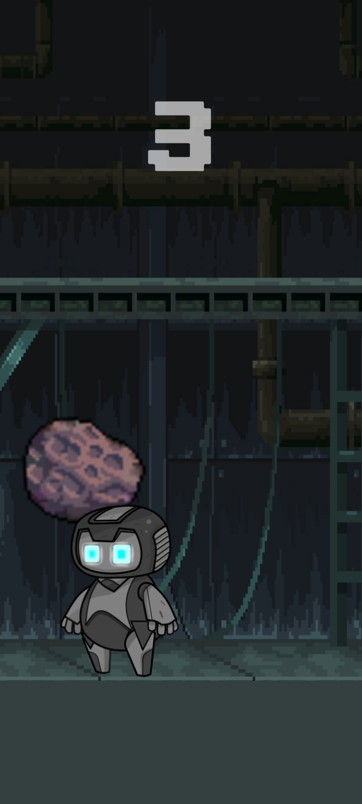

# BotBlitz

Simple game, a lot of fun 🎮.

[]

🚀🌠

This project was created with C#!

🌟 Welcome to BotBlitz! This game is your ticket to an intergalactic adventure filled with laughter and mischief. Join our spacefaring robot, BotBlitz, as he dodges a shower of falling asteroids. Get ready to burst into laughter in the outer space!

🤖 About BotBlitz:

In BotBlitz, you control BotBlitz, a spacefaring robot with a comical personality that will make you smile at every corner of the cosmos. Your mission is simple: keep BotBlitz safe from asteroids and face cosmic chaos with a smile on your face.

## Credits

A shoutout to the talented folks who made this project possible.

- **Developer** - [Paul Contreras](https://github.com/pol-cova)
- **Cute Robot Character** - [Foozle](https://foozlecc.itch.io/)
- **Main Background** - [Ansimuz](https://ansimuz.itch.io/)
- **Epic Font** - [ Eeve Somepx](https://somepx.itch.io/)

# Game Images

📸 Explore the world of "BotBlitz" through these captivating images. Get a glimpse of the game's funny characters, exciting gameplay, and cosmic humor.

*Home Screene*

*Gaming Screen*

*Actual Gameplay*

---

## Download

